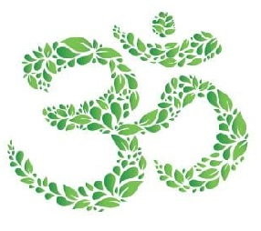

# Shaddai Project

* Descripción: 
	*Es un proyecto que representa un sitio web de un Espacio Holístico dedicado a terapias alternativas.*

* Tecnologías utilizadas: 
    - Se utilizó el lenguaje de Marcado de Hipertexto **HTML** para estructurar y desplegar la página web y sus contenidos.
	- Se utilizó el leguaje de programación de **Javascript** y el framework **React** junto a **Vite** para el desarrollo Front-end del proyecto.
	- Se utilizó **CSS** y el framework **Bootstrap** para darle estilos a los componentes del proyecto.
    -Se utiizó **Firebase** para el hosting del proyecto.

    
    
    
    
    
    
    

* Autor del proyecto:
	**Nicolás Capriz**
